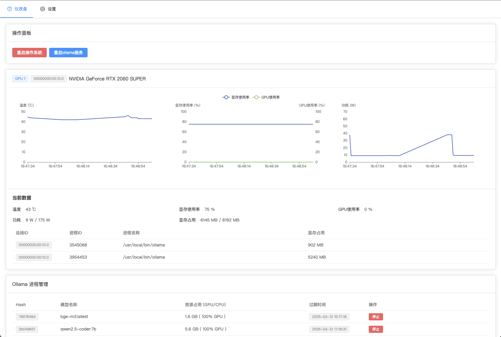

# Ollama Watchdog

## 项目概述

Ollama Watchdog 是一个基于 Vue 3 和 Go 语言开发的项目，主要用于监控和管理 GPU 资源。

项目前端使用 Vue 3 和 ECharts 进行数据可视化，后端使用 Go 语言进行数据处理和监控。

## 运行演示



## 安装

### curl
```bash
curl -sSL https://raw.githubusercontent.com/LanceLRQ/ollama-watchdog/main/install.sh | sh
```

### wget
```bash
wget -qO- https://raw.githubusercontent.com/LanceLRQ/ollama-watchdog/main/install.sh | sh
```

## 安装与运行(开发)

### 前端

1. 克隆项目到本地：
   ```bash
   git clone https://github.com/LanceLRQ/ollama-watchdog.git
   cd ollama-watchdog/web
   ```

2. 安装依赖：
   ```bash
   npm install
   ```

3. 启动开发服务器：
   ```bash
   npm run dev
   ```

4. 构建生产环境代码：
   ```bash
   npm run build
   ```

### 后端

1. 进入后端目录：
   ```bash
   cd src
   ```

2. 运行 Go 服务：
   ```bash
   go run -tags dev .
   # 或者
   sh ./dev.sh
   ```

3. 编译二进制：
   ```bash
   sh ./build.sh
   ```

## 编译环境

`go >= 1.23`


## 贡献

欢迎提交 Issue 和 Pull Request 来帮助改进项目。

## 许可证

本项目采用 MIT 许可证。
